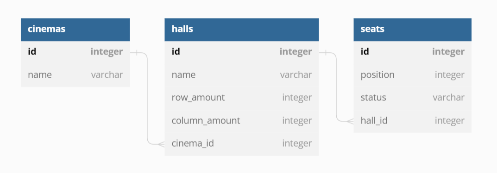

# Simple Movie Booking
Simple Movie Booking System, where only one user could reserve and then buy one or multiple seats. Still in progress, but if checked then any feedback is very much appreciated!

- [Install and Setup](#install-and-setup)
- [Tech-stack](#tech-stack)
- [Progress by Days](#progress-by-days)
  - [Tuesday](##tuesday)
  - [Wednesday](##wednesday)
  - [Thursday](##thursday)
  - [Friday](##friday)
  - [Saturday](##saturday)
  - [Sunday](##sunday)
- [Known bugs, Todos](#known-bugs-todo)
- [Links](#links)

# Install and Setup
1. clone the repository
2. step in both `server` and `client` folders and run `npm i` in the terminal to install dependencies.
3. configure database connection in `server/src/models/sql/db.js` file, you can either use a `.env` file with specific variables or use strings. Pleas also make sure that you have a database to connect to already.
4. first open a terminal then go to `server` folder and run `npm start`, this will initialize our db and start the server (using `npm run dev` will use nodemon).
5. open another terminal and go to `client` folder and run `npm start`, this will start our React frontend.

  By now you can start trying out the app, hopefully!

# Tech-stack
## MySql - Models
An open-source relational database management system for storing, managing and retrieving our structured data. Using Mysql and pairing it with Node.js was a great experience after learning PostgreSql and MongoDB. I only found out about Sequalite which would have made things easier, but I will learn more about it in the future.
## Express - Controller
A web application framework for Node.js. It was essential when defining routes for interacting with the Database early in my project.
## React - View
A JavaScript front-end library for building user interfaces. I dared to use React as Nuxt.js was accepted as a useable framework, however I have not used Vue.js (yet) and I did not want to render templates with view engine, so I kept to this safer choice.
## Node.js - Controller
JavaScript run-time environment that executes JavaScript code outside of a browser (and will act as our server). 
## Additional packages
axios, socket.io (also planning to check/learn how to use nodemailer and Sequalize)

# Progress by Days
I spent about ~30-45 hours from Wednesday to Sunday, including reasearch. Here is my progress day by day..
## Tuesday
I spent Tuesday afternoon with panicking, brainstorming and with minor researching.
## Wednesday
I had memory space issues with my laptop (decided to work in Windows, then decided to make space somehow and work in Ubuntu after hardships with setting up things). I installed and setup MySql then created the database and sample data. 

The picture above shows the fields and relations of my tables. I believe Movies and Halls were mentioned only to understand the task more easily, however I found nice to show a scalable database and simulate a movie ticket booking system more realistically. Interesting thing to note is that I also decided to only create a Seat when it is reserved, then it's status is updated when bought or it gets deleted after 2 mins (with Event). 
## Thursday
Thursday was spent with initiating the DB and refactoring. I had a lot of trouble because I wanted to connect to MySql without a database and then create one (then use changeUser), I had to make do with using an already existing database..
## Friday
Spent time with implementing the Business Loigc, then refactoring the whole project structure to better follow MVC. I also tested the endpoints with Insomnia.
## Saturday
Created all the routes, pages and components for the frontend. Also started fetching from the backend and displaying result.
## Sunday
Started switching out Express endpoints with socket.io's events. Had a lot of trouble with cors() thanks to socket.io but it was necessary to have real-time updates...

# Known bugs, Todos
- you can create a Cinema (for testing socket.io), new Cinema shows up twice thanks to React's Strictmode
- when reserving a Seat, Express endpoint is used because I have to delete previous rooms from clients.
- seat statuses are not updated IRL because socket.io breaks the frontend if I fetch the seats by hall_id again
- had no time to implement sending email with nodemailer
- overall the project is not finished... (yet)

# Links
- https://emily-elim04.medium.com/building-real-time-apps-using-websockets-dc137ccdd34b
- https://www.mysqltutorial.org/mysql-nodejs/create-table/
- https://www.w3schools.com/nodejs/nodejs_email.asp
- https://github.com/sangqle/mysql-crud-nodejs
- https://stackoverflow.com/questions/19197486/mysql-record-that-would-subject-to-ttl
- https://www.youtube.com/watch?v=fPuLnzSjPLE
- https://www.youtube.com/watch?v=djMy4QsPWiI
- https://github.com/ultimateakash/react-socket.io/tree/master
